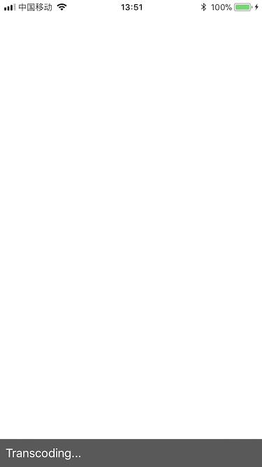

# VideoProcessWithMetal

It's a demo project to illustrate how to process video with `Metal` framework. [This blog](https://tomisacat.xyz/tech/2017/08/06/video-process-with-metal.html) talks about the details.

[The second blog](https://tomisacat.xyz/tech/2018/01/03/imitate-metal-performance-shader.html) talks about how to imitate Metal Performance Shaders.

### Features

> Click titles below to watch demo video on YouTube.

1. [Filter video sample buffer from camera](https://youtu.be/IaKyNHqQ7rk)

    
    
2. [Play local file with AVPlayer](https://youtu.be/y_ycZAzR5Ks)

    
    
3. [Transcode local file with AVAssetReader](https://youtu.be/zZC4Yz3vfgI)

    

### TODO

* [ ] Compute original texture into an intermediate texture instead of computing directly with MTKView(currentDrawable.texture)
* [ ] Switch filter progressively when touch moved 
* [ ] Chaineble filters
* [ ] Queueable commands(filter -> present -> append to file)
* [ ] Clean debug information
* [ ] Remove duplicate code

